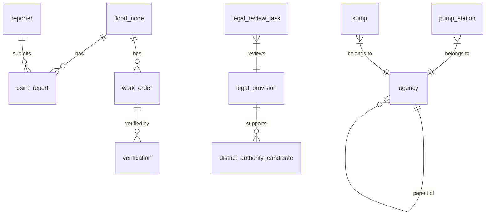

# Floodtir Database Reference

This document describes the principal tables, fields, relationships, and maintenance commands for Floodtir's PostgreSQL, PostGIS, and TimescaleDB data layer.

## Entity Relationship Overview

The schema is organized into three functional groups: operational assets, the action-and-verification loop, and the legal and security registry.



`ledger_entry` and `dispatch_guardrail` are intentionally independent. The former is an append-only audit log, while the latter is a static policy-control table.

## A. Operational and Asset Data

### `flood_node`

Stores official and pilot water-level observation points.

| Field | Type | Description |
|---|---|---|
| `id` | INTEGER, PK | Station identifier |
| `name` | VARCHAR(200), not null | Station or reference-point name |
| `geom` | Geometry(POINT, 4326), not null | Station location with a GiST index |
| `district` | VARCHAR(100), not null | Bangkok district |
| `historical_max_level` | FLOAT, nullable | Historical maximum water level in metres |
| `current_fused_level` | FLOAT, nullable | Most recently fused water level in metres |
| `last_updated` | DATETIME, nullable | Time of the most recent update |
| `n_reports` | INTEGER, default 0 | Number of linked citizen reports |

### `canal`

Stores Bangkok canal and drainage-channel geometry and physical properties.

| Field | Type | Description |
|---|---|---|
| `id` | INTEGER, PK | Canal identifier |
| `name` | VARCHAR(200), not null | Canal name |
| `code` | VARCHAR(100), nullable | Source-system canal code |
| `canal_type` | VARCHAR(100), nullable | Canal classification |
| `district` | VARCHAR(100), nullable | District or districts crossed |
| `geom` | Geometry(GEOMETRY, 4326), not null | Canal geometry with a GiST index |
| `length` | FLOAT, nullable | Length in metres |
| `width` | FLOAT, nullable | Average width in metres |
| `depth` | FLOAT, nullable | Average depth in metres |

### `pump_station`

Stores the location, type, capacity, and responsible organization for each pump station.

| Field | Type | Description |
|---|---|---|
| `id` | INTEGER, PK | Pump-station identifier |
| `name` | VARCHAR(200), not null | Station name |
| `code` | VARCHAR(100), nullable | Source-system station code |
| `pump_type` | VARCHAR(100), nullable | Pump classification |
| `district` | VARCHAR(100), nullable | District |
| `geom` | Geometry(POINT, 4326), not null | Location with a GiST index |
| `capacity` | VARCHAR(100), nullable | Pumping capacity as supplied by the source |
| `owner` | VARCHAR(200), nullable | Responsible organization; semantically linked to `agency.id` |

### `sump`

Stores pumping-well locations and dimensions.

| Field | Type | Description |
|---|---|---|
| `id` | INTEGER, PK | Sump identifier |
| `name` | VARCHAR(200), not null | Sump name |
| `code` | VARCHAR(100), nullable | Source-system code |
| `sump_type` | VARCHAR(100), nullable | Sump classification |
| `district` | VARCHAR(100), nullable | District |
| `geom` | Geometry(POINT, 4326), not null | Location with a GiST index |
| `depth` | FLOAT, nullable | Depth in metres |
| `width` | FLOAT, nullable | Width in metres |
| `length` | FLOAT, nullable | Length in metres |

### `reporter`

Stores external reporters, including citizens, OSINT sources, and LINE integrations.

| Field | Type | Description |
|---|---|---|
| `id` | INTEGER, PK | Reporter identifier |
| `handle` | VARCHAR(100), nullable | User or channel handle |
| `trust_score` | FLOAT, default 0.5 | Trust score from 0.0 to 1.0 |
| `is_simulated` | BOOLEAN, default false | Required simulation label under guardrail G5 |

### `osint_report`

A TimescaleDB hypertable partitioned on `ts`. It stores geolocated flood observations and image-derived water-level estimates.

| Field | Type | Description |
|---|---|---|
| `id` | INTEGER, composite PK | Report identifier |
| `ts` | DATETIME, composite PK | Observation time and TimescaleDB partition key |
| `geom` | Geometry(POINT, 4326), not null | Report location with a GiST index |
| `water_level_m` | FLOAT, nullable | VLM-estimated water depth in metres |
| `confidence` | FLOAT, default 0.0 | Model confidence |
| `photo_ref` | VARCHAR(500), nullable | Evidence image reference |
| `reporter_id` | INTEGER, FK | References `reporter.id` |
| `flood_node_id` | INTEGER, nullable, FK | References the nearest `flood_node.id` |
| `is_simulated` | BOOLEAN, default false | Required simulation label |
| `source_label` | VARCHAR(50), default `citizen` | Input channel such as `citizen` or `line_oa` |

## B. Action and Verification Loop

### `work_order`

Stores dispatch plans such as pump activation or drain-clearing work.

| Field | Type | Description |
|---|---|---|
| `id` | INTEGER, PK | Work-order identifier |
| `flood_node_id` | INTEGER, FK | Affected `flood_node.id` |
| `status` | VARCHAR(20), not null | `pending` → `dispatched` → `done` or `mismatch` |
| `action_type` | VARCHAR(50), not null | Action code such as `activate_pump` or `clear_drain` |
| `assigned_unit` | VARCHAR(200), not null | Assigned operational unit |
| `notes` | TEXT, nullable | Additional instructions or context |
| `approved_by` | VARCHAR(100), nullable | Human operator who approved the plan |
| `confirmed_by` | VARCHAR(100), nullable | Authorized reviewer who confirmed dispatch |
| `created_at` | DATETIME, not null | Creation time |
| `updated_at` | DATETIME, not null | Most recent update time |
| `dispatched_at` | DATETIME, nullable | Actual dispatch time |
| `is_simulated` | BOOLEAN, default true | Simulation label |
| `line_dispatched` | BOOLEAN, default false | Whether the order was sent through LINE |
| `line_dispatched_at` | DATETIME, nullable | LINE dispatch time |

### `verification`

Stores evidence and public feedback used to determine whether conditions improved after a work order.

| Field | Type | Description |
|---|---|---|
| `id` | INTEGER, PK | Verification identifier |
| `work_order_id` | INTEGER, FK | References `work_order.id` |
| `outcome` | VARCHAR(10), not null | `VERIFIED` or `MISMATCH` |
| `photo_ref` | VARCHAR(500), nullable | Verification-image reference |
| `notes` | TEXT, nullable | Reporter notes |
| `verified_by` | VARCHAR(100), nullable | Reporter or verifier identifier |
| `created_at` | DATETIME, not null | Submission time |
| `is_simulated` | BOOLEAN, default false | Simulation label |

### `ledger_entry`

An append-only event ledger protected by a SHA-256 hash chain and Ed25519 signatures.

| Field | Type | Description |
|---|---|---|
| `id` | INTEGER, PK | Ledger sequence identifier |
| `event_type` | VARCHAR(50), not null | Event class such as `Ingest`, `DispatchPlan`, or `CitizenVerify` |
| `payload` | TEXT, not null | Canonical event JSON |
| `prev_hash` | VARCHAR(64), not null | SHA-256 hash of the preceding record |
| `hash` | VARCHAR(64), not null | SHA-256 hash derived from the payload and previous hash |
| `signature` | TEXT, not null | Ed25519 signature |
| `data_class` | VARCHAR(30), not null | `REAL`, `SIMULATED-by-design`, or `PENDING-WIRE` |
| `created_at` | DATETIME, not null | Ledger insertion time |

## C. Legal and Security Registry

These tables support authority review under Thailand's Disaster Prevention and Mitigation Act, B.E. 2550 (2007), and Bangkok Metropolitan Administration Act, B.E. 2528 (1985). They do not allow the platform or AI to make legal determinations automatically.

### `agency`

Stores BMA departments and district offices together with their hierarchy.

| Field | Type | Description |
|---|---|---|
| `id` | VARCHAR(100), PK | Agency identifier such as `bma-district-1001` |
| `name_th` | VARCHAR(200), not null | Official Thai name |
| `name_en` | VARCHAR(200), nullable | English name |
| `agency_type` | VARCHAR(100), not null | Agency classification |
| `parent_agency_id` | VARCHAR(100), nullable, FK | References the parent `agency.id` |
| `is_simulated` | BOOLEAN, not null | Simulation label |

### `legal_provision`

Stores source-backed legal provisions and the action codes they may support.

| Field | Type | Description |
|---|---|---|
| `provision_hash` | VARCHAR(64), PK | SHA-256 hash of the provision content |
| `source_id` | VARCHAR(200), not null | Source-document identifier |
| `provision_reference` | VARCHAR(100), not null | Provision or section reference |
| `authority_type` | VARCHAR(100), not null | Authority classification |
| `territorial_scope` | VARCHAR(100), not null | Geographic scope |
| `action_codes` | JSONB, not null | Supported operational action codes |
| `requires_action_specific_order` | BOOLEAN, not null | Whether a separate written order is required |
| `may_auto_dispatch` | BOOLEAN, not null | Whether automatic dispatch is legally permitted; normally false |
| `is_simulated` | BOOLEAN, not null | Simulation label |

### `district_authority_candidate`

Links candidate district roles to supporting legal provisions for all 50 Bangkok districts.

| Field | Type | Description |
|---|---|---|
| `id` | INTEGER, PK | Candidate identifier |
| `district` | VARCHAR(100), not null | Official district name, normally in Thai |
| `role` | VARCHAR(100), not null | Candidate authorized role |
| `authority_provision_hashes` | JSONB, not null | References to `legal_provision.provision_hash` |
| `is_simulated` | BOOLEAN, not null | Simulation label |

### `dispatch_guardrail`

Defines authorization requirements and risk controls for operational action codes.

| Field | Type | Description |
|---|---|---|
| `id` | INTEGER, PK | Guardrail identifier |
| `action_code` | VARCHAR(100), not null | Operational action code |
| `is_prohibited_without_auth` | BOOLEAN, not null | Whether legal and human authorization is mandatory |
| `is_allowed_before_approval` | BOOLEAN, not null | Whether preliminary processing may occur before approval |
| `is_simulated` | BOOLEAN, not null | Simulation label |

### `legal_review_task`

Stores the human legal-review queue for candidate assignments and disputed actions.

| Field | Type | Description |
|---|---|---|
| `id` | INTEGER, PK | Database identifier |
| `task_id` | VARCHAR(100), not null | Stable review-task hash |
| `review_type` | VARCHAR(100), not null | Review classification |
| `source_id` | VARCHAR(100), not null | Source-document identifier |
| `provision_id` | VARCHAR(100), nullable | Provision under review |
| `review_question` | TEXT, not null | Question presented to the reviewer |
| `required_reviewer_role` | VARCHAR(100), not null | Required role, such as `legal_reviewer` |
| `status` | VARCHAR(50), not null | `open` → `reviewed` or `approved` |
| `created_at` | DATETIME, not null | Queue insertion time |
| `is_simulated` | BOOLEAN, not null | Simulation label |

## Migrations and Maintenance

Create a new migration after changing a model in `apps/api/src/api/models/`:

```bash
cd apps/api
uv run alembic revision --autogenerate -m "describe_your_changes_here"
uv run alembic upgrade head
```

Rebuild the legal-responsibility reference data:

```bash
uv run --package api python scripts/seed_legal_responsibility.py --clear
```

The `--clear` option removes existing legal-reference seed records before loading the current source-backed dataset. Use it only in an environment where replacing those records is intended.
